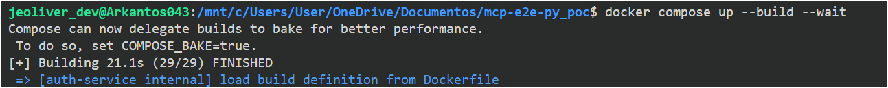
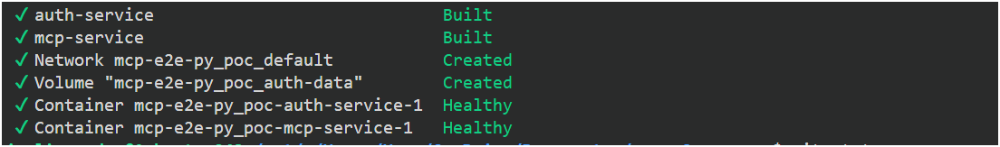
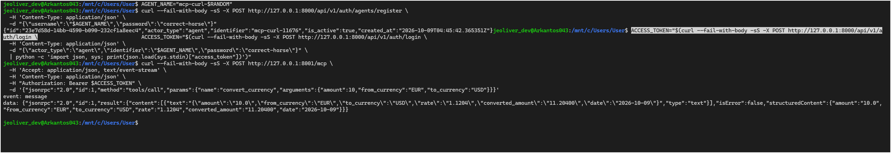
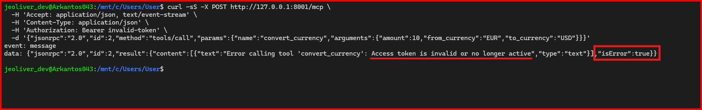

# MCP E2E Python PoC

Conforme al laboratorio desarrollado, este proyecto permite realizar un consumo de una capacidad (https://frankfurter.dev/es/) de cambio de divisas a traves del protocolo mcp. Consta de un servicio de autenticación y autorización y un servidor mcp.  

## Componentes

- [`auth-service`](./auth-service): servicio FastAPI que registra identidades, emite JWT y
  valida tokens de acceso.
- [`mcp-service`](./mcp-service): servidor FastMCP con transporte Streamable HTTP y la
  herramienta `convert_currency`, protegida por el permiso `fx:read`.

Las identidades de tipo `agent` reciben `fx:read`. Las identidades
humanas y administradoras no reciben ese permiso y no pueden ejecutar la herramienta.

## Levantar con Docker

Se requiere Docker Desktop con Docker Compose v2.

1. Se construyen e inician los servicios:

   ```bash
   docker compose up --build --wait
   docker compose ps
   ```

   En el primer arranque, `auth-service` genera automáticamente un secreto JWT aleatorio y
   lo guarda con permisos restringidos dentro del volumen `auth-data`. Este secreto se
   reutiliza en reinicios, por lo que las sesiones permanecen válidas.

2. De forma opcional, se copia `.env.example` a `.env` para cambiar los puertos o definir
   explícitamente `AUTH_JWT_SECRET`. Esto es necesario cuando se controla el secreto o se
   despliega fuera de un entorno local de prueba.

Como se puede evidenciar con `docker compose ps`, ambos servicios quedan en estado `healthy`.





Las URLs locales son:

- Swagger de autenticacion: `http://127.0.0.1:8000/docs`
- Salud: `http://127.0.0.1:8000/health`
- Endpoint MCP Streamable HTTP: `http://127.0.0.1:8001/mcp`

Los puertos se publican solo en `127.0.0.1`. El MCP resuelve el servicio de autenticacion
por la red privada de Docker mediante `http://auth-service:8000`; no se expone este enlace
interno al host.

Para detener los servicios sin borrar identidades ni tokens, se ejecuta:

```bash
docker compose down
```

Para borrar tambien todos los datos de SQLite, se ejecuta:

```bash
docker compose down -v
```

## Primera Operacion

Con los contenedores saludables, el siguiente script estandar de Python registra un agente,
inicia sesion y convierte 10 EUR a USD mediante Frankfurter:

```bash
python scripts/mcp_smoke_test.py
```

La salida contiene la respuesta JSON-RPC de MCP. Dentro de `result.content` aparece el
importe convertido, el tipo de cambio y la fecha efectiva. El script crea una identidad
efimera nueva en cada ejecucion y respeta `AUTH_SERVICE_PORT` y `MCP_SERVICE_PORT` si se
definen en `.env`.

## Para Explorar

Se puede consultar directamente el estado de los contenedores y sus logs:

```bash
docker compose ps
docker compose logs -f auth-service
docker compose logs -f mcp-service
```

### Consumir el MCP con curl

FastMCP se ejecuta en modo HTTP sin estado. Por ello, cada solicitud valida su propio Bearer
token contra `auth-service`, no requiere gestionar una sesión MCP y puede consumirse con un
único `curl`. El valor de `ACCESS_TOKEN` se obtiene mediante el endpoint de login de una
identidad `agent`, que es la única identidad que recibe el permiso `fx:read`.

Primero se define y registra una identidad de agente. El sufijo aleatorio permite repetir el
ejemplo sin colisionar con una identidad existente:

```bash
AGENT_NAME="mcp-curl-$RANDOM"
```

```bash
curl --fail-with-body -sS -X POST http://127.0.0.1:8000/api/v1/auth/agents/register \
  -H 'Content-Type: application/json' \
  -d "{\"username\":\"$AGENT_NAME\",\"password\":\"correct-horse\"}"
```

Después se inicia sesión y se declara `ACCESS_TOKEN` a partir del `access_token` que devuelve
`auth-service`:

```bash
ACCESS_TOKEN="$(curl --fail-with-body -sS -X POST http://127.0.0.1:8000/api/v1/auth/login \
  -H 'Content-Type: application/json' \
  -d "{\"actor_type\":\"agent\",\"identifier\":\"$AGENT_NAME\",\"password\":\"correct-horse\"}" \
  | python -c 'import json, sys; print(json.load(sys.stdin)["access_token"])')"
```

Con el token ya declarado, se ejecuta la operación autorizada:

```bash
curl --fail-with-body -sS -X POST http://127.0.0.1:8001/mcp \
  -H 'Accept: application/json, text/event-stream' \
  -H 'Content-Type: application/json' \
  -H "Authorization: Bearer $ACCESS_TOKEN" \
  -d '{"jsonrpc":"2.0","id":1,"method":"tools/call","params":{"name":"convert_currency","arguments":{"amount":10,"from_currency":"EUR","to_currency":"USD"}}}'
```

Como se puede observar a continuación, la respuesta contiene `"isError": false` y el resultado de la
conversión. La operación se ejecuta solo después de validar que el token está activo y contiene
el permiso `fx:read`.




Para comprobar el rechazo de un token inválido, se ejecuta la misma solicitud con un Bearer
que no es válido. La respuesta contiene `"isError": true` y Frankfurter no recibe ninguna
llamada:

```bash
curl -sS -X POST http://127.0.0.1:8001/mcp \
  -H 'Accept: application/json, text/event-stream' \
  -H 'Content-Type: application/json' \
  -H 'Authorization: Bearer invalid-token' \
  -d '{"jsonrpc":"2.0","id":2,"method":"tools/call","params":{"name":"convert_currency","arguments":{"amount":10,"from_currency":"EUR","to_currency":"USD"}}}'
```



### Otros ejemplos con curl

El siguiente registro de agente es exitoso. El sufijo aleatorio permite repetir el comando sin
colisionar con una identidad existente; la respuesta es `201 Created`:

```bash
curl -i -X POST http://127.0.0.1:8000/api/v1/auth/agents/register \
  -H 'Content-Type: application/json' \
  -d "{\"username\":\"curl-agent-$RANDOM\",\"password\":\"correct-horse\"}"
```

La siguiente validacion falla sin token. La respuesta es `401 Unauthorized` y contiene
`www-authenticate: Bearer`:

```bash
curl -i http://127.0.0.1:8000/api/v1/auth/validate
```

Se puede consultar una conversion historica:

```bash
python scripts/mcp_smoke_test.py --amount 25 --from-currency EUR --to-currency USD --date 2024-05-15
```

Se puede comprobar la autorizacion negativa. Una identidad humana se autentica correctamente,
pero la tool devuelve un error porque no posee `fx:read`:

```bash
python scripts/mcp_smoke_test.py --actor-type human
```

Se puede cambiar el par de monedas o el importe:

```bash
python scripts/mcp_smoke_test.py --amount 100 --from-currency GBP --to-currency JPY
```

Los endpoints de registro, login, refresh, validacion y logout se consultan desde Swagger.
Para conectar un cliente MCP compatible, se configura Streamable HTTP con la URL
`http://127.0.0.1:8001/mcp` y se reenvia el JWT de una identidad `agent` como cabecera
`Authorization: Bearer <access_token>` en cada solicitud.

## Desarrollo Local

Cada servicio conserva su configuracion, dependencias y lockfile independiente. Se consultan
los README de [`auth-service`](./auth-service) y [`mcp-service`](./mcp-service) para usar
`uv` sin Docker.
